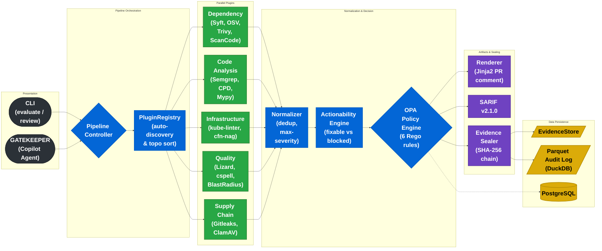

# Eagle Eyed Dom

Eagle Eyed Dom (eedom) is a fully deterministic dependency and code review engine for CI — it does the mechanical half of every PR review so engineers can focus on the half that requires judgment. Every PR that touches a dependency manifest or source file triggers the same tedious checklist: known CVEs, license compatibility, package age, leaked secrets, copy-paste duplication, cyclomatic complexity — eedom runs all of it in under ten minutes, without a human. 

The pipeline detects changed packages across 36 ecosystems, fans out across 36 specialist plugins in parallel (Syft, OSV-Scanner, Trivy, ScanCode, Semgrep, Gitleaks, ClamAV, and more), deduplicates overlapping findings by advisory ID with highest-severity-wins logic, then hands the normalized result set to an OPA policy engine that makes the accept/reject decision in pure Rego — no prompts, no probability, no "it depends on the model's mood today."

 What makes eedom different is the constraint it refuses to break: zero LLM in the decision path. The build passes or fails on deterministic rules that any engineer can read, audit, and debate — not on a language model's interpretation of those rules. 

It's also fail-open by design: every scanner runs in its own timeout envelope, every failure returns a typed `ScanResult` and the pipeline continues, so a missing binary or a PyPI timeout never silently blocks a deploy. 

Two entry points drive the same pipeline — a CLI for CI and a GitHub Copilot Agent (GATEKEEPER) for reactive PR review — and every run writes tamper-evident evidence sealed with a SHA-256 hash chain and appended to a Parquet audit lake queryable with DuckDB. Eedom is built for platform and security engineering teams that need a CI gate with a defensible audit trail, not a vibes-based review bot. 

Teams that adopt it reclaim the senior engineer time currently spent answering "is this dep safe?" on the fourth PR of the afternoon — and they get a chain of custody from PR diff to production container image via SLSA Level 3 attestation as a bonus.

---

## Architecture

